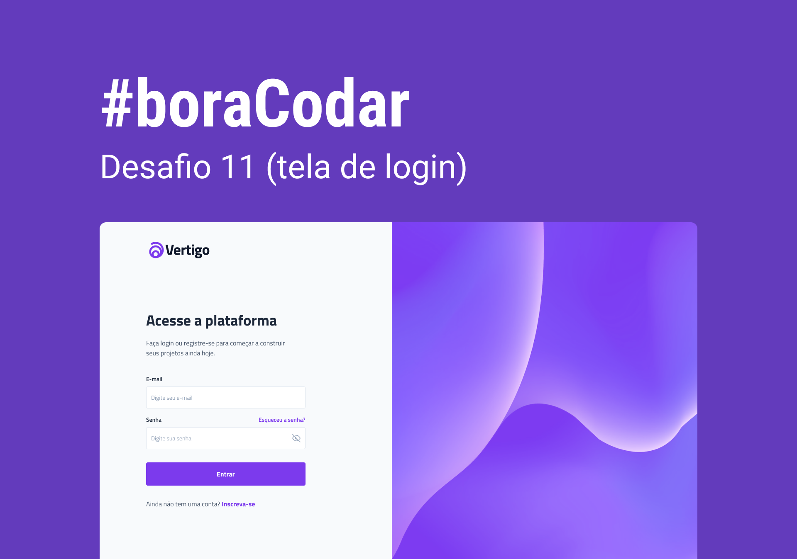

<h1 align="center"> boraCodar#11 - Página de Login</h1>

Neste desafio 

  <a href="#tecnologias">Tecnologias</a>&nbsp;&nbsp;&nbsp;|&nbsp;&nbsp;&nbsp;
  <a href="#projeto">Projeto</a>&nbsp;&nbsp;&nbsp;|&nbsp;&nbsp;&nbsp;
  <a href="#layout">Layout</a>&nbsp;&nbsp;&nbsp;|&nbsp;&nbsp;&nbsp;
  <a href="https://boracodar11.netlify.app/">Deploy</a>&nbsp;&nbsp;&nbsp;|&nbsp;&nbsp;&nbsp;

 

<h2 id="tecnologias">🚀 Tecnologias</h2>

Esse projeto foi desenvolvido com as seguintes tecnologias:

- HTML e CSS
- JavaScript
- Git e Github

<h2 id="projeto">💻 Projeto</h2>

É um desafio com a proposta de desenvolver uma simples página de login responsiva, com uma validação em front-end simples que apresenta mensagens de erro. 

<h2 id="layout">🚀 Layout</h2>

Você pode visualizar o layout do projeto através [DESSE LINK](https://www.rocketseat.com.br/boracodar/desafios-anteriores/uma-pagina-de-login-desafio-11). É necessário ter conta no [Figma](https://figma.com) para acessá-lo.
