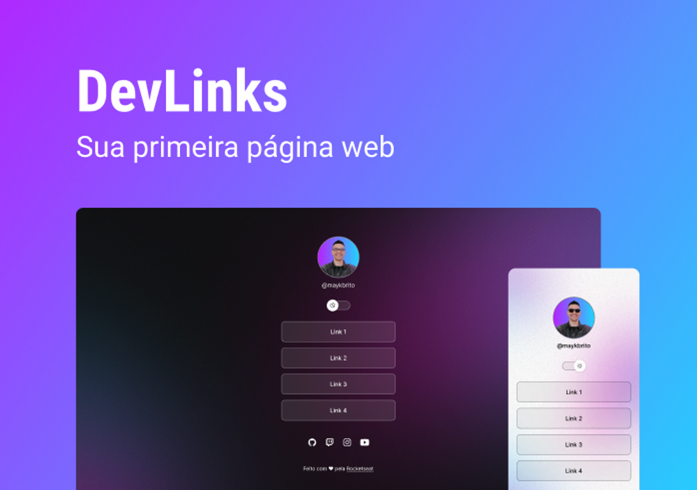

# DevLinks

## Sobre
Curso introdutório sobre HTML, CSS, Javascript e GIT com um projeto final de um agregador de links (link tree)

## Layout 

Você pode visualizar o layout do projeto através [DESSE LINK](https://www.figma.com/community/file/1187422022288947321). É necessário ter conta no Figma para acessá-lo.

## Material

Você pode conferir as anotações e informações da aula [aqui](https://efficient-sloth-d85.notion.site/DevLinks-d7841615addc4269ba5c5bba12a6edbe).