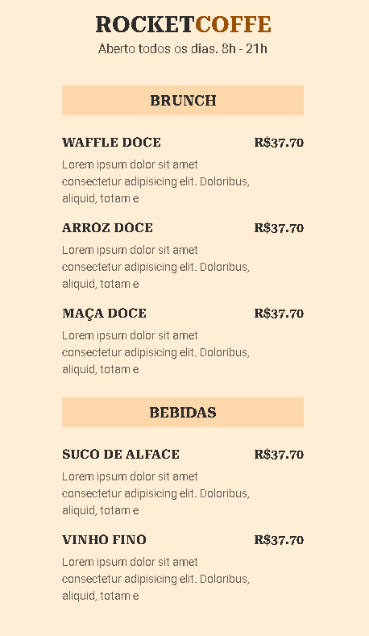

# Maratona Explorer



## Sobre
Conjunto de 3 aulas providas pela plataforma da rocketseat que irá tratar de tecnologias básicos do desenvolvimento WEB: HTML e CSS. Com um projeto final de um site catálogo de pratos de um restaurante com a criação de um QR Code

Este repositório representa meu primeiro contato com HTML e CSS

---

<details>
<summary> Aula 1 - O início da Jornada: fundamentos HTML e conceitos básicos de programação </summary>
  <p>

- O que é front-end?
    
    É a parte responsável pela interação com o usuário, onde na web por exemplo, será exibido o HTML, CSS, Js, imagens, etc
    
- O que é back-end?
    
    Se refere à parte estrutural de uma aplicação, que fica em um computador instalado com um SO de servidor
    
- Como o front-end e o back-end se comunicam?
    
    Através da comunicação de dados entre cliente-servidor, que de maneira simples, o cliente faz uma requisição e o servidor manda uma resposta sobre aquele pedido 
    
- Tecnologias Front-End
    - O que é o HTML?
        
        Hyper Markup Text Language - linguagem de estruturação dos textos e imagens em uma página web, bem como personalizações básicas de texto
        
        - O que são tags?
            
            São divisões/categorias que o texto pode ter. Todas elas estão em [Tags e Atributos HTML](https://www.notion.so/Tags-e-Atributos-HTML-136ff13b6a194832b856174ff41fc6e3) 
            
            ```html
            <a> </a> <!-- tag de hyper link -->
            <tag> </tag> <!-- sintaxe -->
            ```
            
        - O que são atributos?
            
            São informações adicionais que passamos para as tags
            
            ```html
            <a nomedoatributo="conteúdo do atributo">conteúdo</a>
            ```
            
        - Qual a sintaxe de um comentário?
            
            ```html
            <!-- Sintaxe de comentário -->
            <!--
            Lorem ipsum
            Lorem ipsum
            Lorem ipsum
            -->
            ```
            
    - O que é o CSS?
        
        Cascate Style Sheet (Folha de Estilos em Cascata) - é uma linguagem de estilo utilizada para personalizar o HTML
        
    - O que é o Javascript?
        
        Linguagem de programação utilizada pelos browsers empregada em eventos de interação com o usuário nas páginas web entre outros
        
- Tecnologias Back-End
    - Node JS
        
        Tecnologia JS - ambiente de execução de javascript ao lado de servidor (server side)
        
    - SQL
        
        Structured Query Language - (Linguagem de Consulta Estruturada). Linguagem de programação para manipulação de bases de dados
        
        - O que é uma base de dados? (Obs.: inf estruturadas)
            
            É uma coleção organizada de informações estruturadas/É um grupo de dados 
            
        - Qual a diferença entre SQL e MySQL
            
            SQL é uma linguagem utilizada para manipular base de dados. MySQL já é uma plataforma que utiliza SQL para gerenciar base de dados relacionais 
            
        - O que é uma base de dados relacional?
            
            É uma base de dados estruturada em formato de tabela com linhas e colunas
  </p>
</details>

<details> <summary>Aula 2 - Descomplicando código: CSS </summary>
    <p>

- Pra que serve o CSS?
    
    Ele serve para adicionar personalização ao HTML, uma apresentação visual melhor
    
- Como adiciona o CSS no HTML?
    
    ```css
    <head>
    	<link rel="stylesheet" href="exemplo.css"
    </head>
    ```
    
- Quais são os princípios do CSS?
    - **Cascading/cascata:** ordem de prioridade de baixo para cima, mais importante para menos importante, com a última sendo a mais importante
    - **Especificidade:** o nível de especificidade do seletor dita também a prevalência entre personalização de um seletor e outro
    - **Box Model:** todo elemento HTML é como se fosse uma caixa, com propriedades de altura, espaçamento interno e externo, etc
        
        
        
- O que é uma declaração?
    
    É um pedaço de código que serve para especificar o elemento HTML que terá uma personalização
    
- Sintaxe
    - Qual a sintaxe de uma declaração?
        
        Seletor, abre chaves, propriedade, valor, fecha chaves
        
        ```css
        seletor {
        propriedade: valor;
        }
        ```
        
    - Como é um comentário?
        
        ```css
        /*  COMENTÁRIO */
        ```
        
    - Como é estruturado o CSS?
        
        É organizado em **cascatas:** isto é. as declarações são classificadas em ordem de prioridade de menos à a maior relevância, de cima para baixo, seja entre as declarações ou as propriedades e **prioridades:** especificidade do seletetor
        
    - Quais são os seletores no CSS?
        - Elemento
        - Classe
        - ID
            
            ```css
            elemento {
            /* peso 10*/
            }
            
            .class {
            /* peso 10*/
            }
            #id {
            /* peso 100 */
            }
            ```
            
    - Nomenclatura de seletores
    </p>
</details>

<details> 
    <p>
        - [X]  Como instalar o VS Code
        - [X]  Funcionamento básico do GIT
        - [X]  Deploy no Netlify
    </p>
</details>

<details> <summary> Material Complementar</summary>
<p>
    - Link do projeto: [figma](https://www.figma.com/community/file/1138209866997102496)
    - 
    - 
    - 
</p>
</details>
